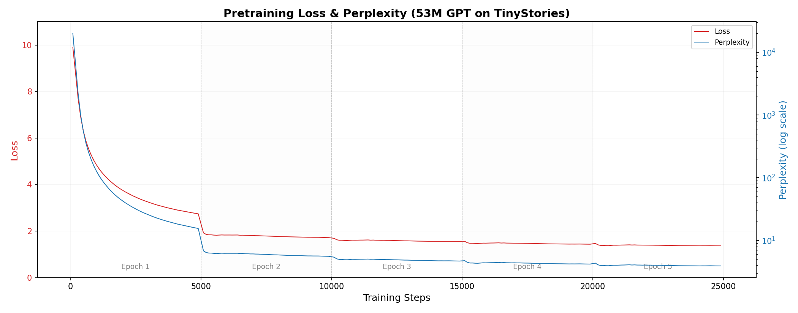
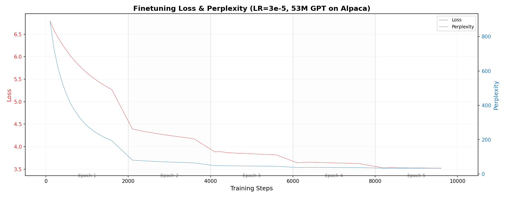

# Tiny GPT Storyteller

[](https://github.com/chenming-liang/tiny-gpt-storyteller)
[](https://pytorch.org/)
[](https://www.python.org/)

> **深度学习课程结课项目（Course Project）**

基于 minGPT 架构实现并训练一个约 **56.5M 参数**的 GPT 模型，不借助任何预训练权重，完整走通「**预训练 Pretraining → 指令微调 SFT**」全流程，最终得到一个既能续写英文小故事、又能遵循指令格式作答的讲故事模型。

## 项目简介 Overview

- 基于 PyTorch 实现 decoder-only Transformer（GPT，架构参考 [minGPT](https://github.com/karpathy/minGPT)），并完成预训练、SFT、评测与推理全流程；
- 使用 **TinyStories** 语料预训练，再用 **Alpaca（清洗版，52K）** 进行指令微调；
- 全程开启 AMP 混合精度与 wandb 实验记录；附 NeurIPS 风格的技术报告（LaTeX 源码与编译版 PDF）。

## 关键结果 Key Results

| 阶段 Stage | 数据集 Dataset | Split | Loss | PPL |
|------------|----------------|-------|------|-----|
| 预训练 Pretraining | [TinyStories](https://huggingface.co/datasets/roneneldan/TinyStories) | Train | **1.37** | **3.93** |
| 指令微调 SFT | [Alpaca-cleaned](https://huggingface.co/datasets/yahma/alpaca-cleaned) (52K) | Train | **3.52** | **33.76** |

<p align="center">
  <br/>
  <sub>预训练 Loss / PPL 曲线（5 epochs）</sub>
</p>

<p align="center">
  <br/>
  <sub>指令微调 Loss / PPL 曲线（5 epochs）</sub>
</p>

## 模型 Model

| 配置 | 取值 | 说明 |
|------|------|------|
| Tokenizer | GPT-2 BPE（vocab 50,257） | HuggingFace `AutoTokenizer` |
| Context length | 256 | 输入截断到 256 tokens |
| d_model / n_heads / n_layers | 384 / 12 / 10 | 自回归 decoder-only |
| 参数量 | ~56.5M | 各超参数见 `src/config.py` |

## 训练方法 Training Approach

**预训练 Pretraining（`src/pretrain.py`）**
- 数据：TinyStories（streaming 流式读取，训练集在线 tokenize）；
- 优化：AdamW（lr=3e-4，β=(0.9, 0.95)，weight_decay=0.1）+ cosine schedule，warmup 1000 steps；
- 设置：batch size 64，5 epochs × 5000 steps，dropout=0.0，AMP 混合精度；
- 损失：标准自回归交叉熵。

**指令微调 SFT（`src/finetune.py`）**
- 数据：Alpaca-cleaned 52K，结构化为 `### Instruction / ### Input / ### Response`；
- 优化：AdamW（lr=3e-5，β=(0.9, 0.95)，weight_decay=0.1）+ cosine schedule；
- 设置：batch size 32，5 epochs（约 1625 steps/epoch），dropout=0.1；
- 关键技巧：**response-only loss masking**——仅对 response 部分计算交叉熵损失，减少指令模板等非目标 token 对训练目标的干扰；微调后故事续写能力基本保留。

## 评测 Evaluation

**定量**（对预训练模型）

| 评测集 | Loss | PPL | 说明 |
|--------|------|-----|------|
| TinyStories 验证集（领域内） | 1.48 | 4.41 | 同域文本预测能力强 |
| WikiText-2（跨领域） | 9.29 | 10,779.34 | 分布外文本，PPL 高符合预期 |

**定性**（基于预训练 / 微调模型的生成样例分析）

- 预训练模型：能根据提示生成连贯、带基本情节与寓意的英文短故事；人物与情节基本稳定；但长文本中偶发上下文不一致（如角色名漂移），且不具备事实知识问答能力；
- 微调模型：学会了 Alpaca 指令格式，能按要求写作主题故事与简单问答；直接的故事续写能力基本保留；
- 局限：受限于 ~56.5M 规模与纯故事/指令语料，事实性知识仍较弱——属于数据与规模约束下的预期结果。

## 快速开始 Quick Start

环境依赖：`torch`、`transformers`、`datasets`、`wandb`（数据以 streaming 方式从 HuggingFace 加载）。

```bash
# 1. 预训练（TinyStories）
python src/pretrain.py

# 2. 指令微调（Alpaca，基于预训练 checkpoint）
python src/finetune.py

# 3. 评测与生成对比（pretrained / finetuned 并排样例）
python src/evaluate.py compare
```

## 项目结构 Project Structure

```
├── README.md                  # 本文件
├── project.pdf                # 技术报告（编译版 PDF）
├── report/                    # 技术报告源码（NeurIPS 模板）
│   ├── report.tex             # LaTeX 源码
│   ├── neurips.sty
│   ├── pretrain_loss.png      # 预训练曲线
│   └── finetune_loss.png      # 指令微调曲线
└── src/                       # 训练与评测代码
    ├── config.py              # 模型与训练超参数
    ├── model.py               # GPT 模型定义（minGPT 风格）
    ├── pretrain.py            # TinyStories 预训练
    ├── finetune.py            # Alpaca 指令微调
    └── evaluate.py            # 定量评测 + 生成样例
```

## 报告 Report

技术报告按 NeurIPS 模板撰写，涵盖数据与模型细节、训练/微调全流程、逐轮 Loss 与 PPL 曲线、定量与定性评测及大量生成样例分析：

- LaTeX 源码：[`report/report.tex`](report/report.tex)
- 编译版 PDF：[`project.pdf`](project.pdf)

## 致谢 References

- TinyStories: Eldan, R., & Li, Y. (2023). *TinyStories: How Small Can Language Models Be and Still Speak Coherent English?* [arXiv:2305.07759](https://arxiv.org/abs/2305.07759v2)
- Self-Instruct / Alpaca: Wang, Y., et al. (2023). [arXiv:2212.10560](https://arxiv.org/abs/2212.10560)
- minGPT: Karpathy, A. <https://github.com/karpathy/minGPT>
- Tokenizer: HuggingFace `transformers` 的 GPT-2 tokenizer

---

本项目为深度学习课程结课项目，目标是通过完整复现「预训练 + 指令微调」来理解语言模型的训练原理与工程全流程。
